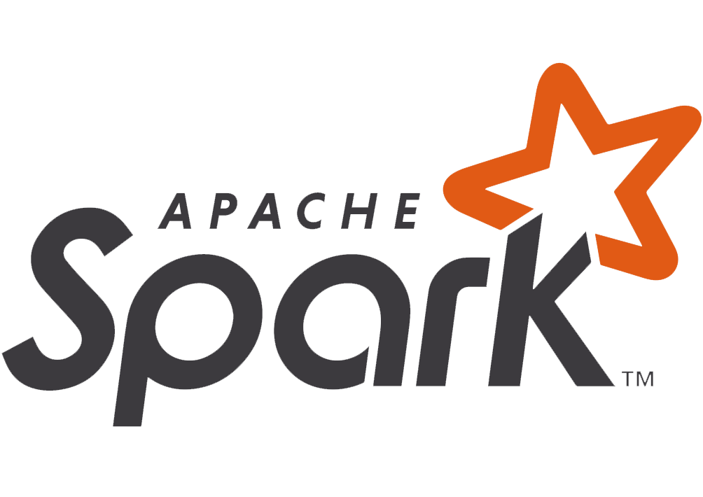

# Hi, I'm Efrain 👋


```js
```
I am a Data Science student, I consider myself an optimistic person, accustomed to working in a dynamic and organized way, and I have a desire to improve and learn.
Currently I am dedicated to research in the area of ​​Big Data.

<h3 align="left">Technologies that I use:</h3>
<pre align="center">
                     
</pre>

## Find me around the web 🌎: <a href="https://github.com/sponsors/M0nica"></a>
- Learning in public on <a href="https://www.twitch.tv/blacktechdiva">Twitch</a> or <a href="https://www.monica.dev">monica.dev</a> 📹 ✍🏾
- Tinkering with interactions on <a href="https://codepen.io/m0nica"> Codepen</a> 🏓
- Sharing updates on <a href="https://www.linkedin.com/in/monicampowell/">LinkedIn</a> 💼
